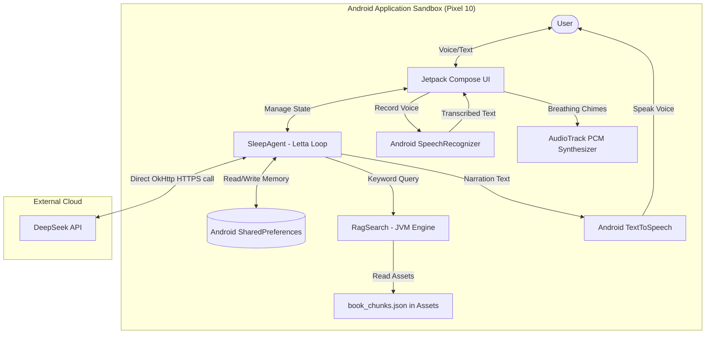

# AI Sleep Advisor - Native Android System Architecture

This document describes the architectural design of the **AI Sleep Advisor**, a serverless, privacy-first native Android application written in **Kotlin** and **Jetpack Compose** designed to run 100% on-device on a Pixel 10 mobile phone.

---

## 1. System Overview

The system is designed to be **100% client-side**. It requires no backend database server or API proxy, relying on Android's private `SharedPreferences` storage for long-term memory, and on-device native platform APIs for speech and audio synthesis. The only external network call is made directly from your phone to the official DeepSeek API over an encrypted HTTPS connection.

---

## 2. Key Architecture Components

### A. Jetpack Compose UI
Provides a high-performance, dark glassmorphic mobile interface:
- **Dashboard**: Displays rolling CBT-I stats (sleep efficiency, durations, log count), todays progress checklist, and active week milestone instructions.
- **Voice Chat**: Features a custom canvas-drawn pulsing coaching orb, waveform animations, and a scrollable message bubble transcript with a collapsible keyboard typing toggle.
- **Diary Form**: Replicates Dr. Gregg Jacobs' 60-Second Sleep Diary with real-time time-in-bed and efficiency calculation feedback. It auto-prefills with today's logged data if it exists in history.
- **Relaxation Room**: Guided box breathing animations with PCM sine-wave chime synthesis.
- **Memory Inspector**: Displays the active Letta core human and assistant memories in raw JSON for transparency, plus an archival database manager.
- **Settings**: Configures voice pitch/speed sliders and holds secure testing utilities (mock database seeders).

### B. Client-Side RAG (Retrieval-Augmented Generation)
- **Asset Compilation**: The sleep science book `sayGoodbyeToInsomenia.txt` is split into paragraph chunks and compiled into `book_chunks.json` under the Android assets directory.
- **JVM Search Engine**: A custom Kotlin TF-IDF keyword scorer (`RagSearch.kt`) searches this file directly on the JVM in **under 3ms**, feeding relevant passages to the SleepAgent.

### C. Letta-Style Cognitive Memory Loop
Implements a stateful memory loop mimicking advanced agent architectures:
- **Core Memory (Human)**: A mutable JSON block storing your personal age, symptoms, medications, lifestyle details, and CBT week milestones.
- **Core Memory (Persona)**: Interaction guidelines for the coach.
- **Archival Memory**: An array database storing permanent facts and milestone events over time.
- **Recall Memory**: Conversational message histories (limited to the last 20 messages to keep the context window compact).
- **Incremental Distillation**: When the DeepSeek LLM wants to save details, it returns standard function calls (e.g. `save_sleep_diary`, `update_human_memory`). The `SleepAgent` interceptor executes these functions, updates SharedPreferences, and feeds the results back to the agent turn. The agent updates memory incrementally turn-by-turn so that no details are lost.

### D. Native Speech Engine (STT & TTS)
- **Speech-to-Text (`SpeechSTT.kt`)**: Wraps Android's native `SpeechRecognizer` using standard audio recording intents. Supports continuous transcription with automatic silence detection thresholds.
- **Text-to-Speech (`SpeechTTS.kt`)**: Wraps Android's native `TextToSpeech` engine. It filters system-installed voices to specifically select Google English male voice packages (e.g. `x-iom`, `x-iol`, `x-rjs`) and dynamically cleans out Markdown formatting (asterisks, bullet points, headers) before playback.

### E. PCM Audio Synthesizer (`Breathe.kt`)
- Bypasses static sound files by generating pure sine-wave audio signals (chimes) dynamically on the fly.
- Writes PCM byte data directly to Android's `AudioTrack` API using an exponential volume decay formula to produce a pleasant bell ring at box-breathing phase changes.

---

## 3. Data Privacy & Security Design

- **Private Application Sandbox**: All sleep logs, daytime stress notes, and chat transcriptions reside strictly in the app's private SharedPreferences directory (`/data/data/com.sleepadvisor/`). No third-party servers or proxy servers have access to this data.
- **Secure Secret Handling**: The DeepSeek API key is loaded dynamically from an untracked local file `ApiKey.kt` (ignored in Git) and is compiled directly into the application, keeping it completely safe from GitHub exposure.
- **Encrypted Outbound Calls**: Outbound connections to `api.deepseek.com` use standard Transport Layer Security (HTTPS via OkHttp), keeping your API key and conversations fully encrypted in transit.
