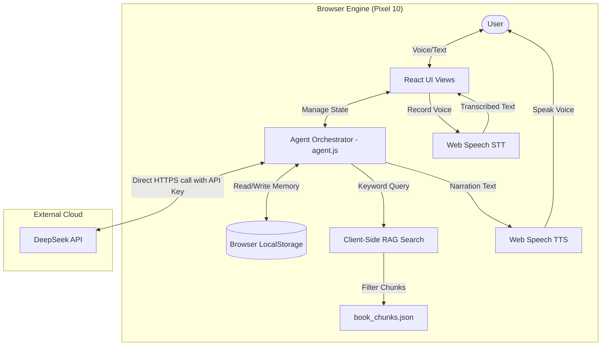

# AI Sleep Advisor - System Architecture

This document describes the architectural design of the **AI Sleep Advisor**, a serverless, privacy-first Progressive Web App (PWA) designed to run on-device on a Pixel 10 mobile phone.

---

## 1. System Overview

The system is designed to be **100% client-side**. It requires no backend database server or API proxy, relying on local browser storage for long-term memory and on-device Web APIs for speech. The only external network call is made directly from your phone to the official DeepSeek API over an encrypted HTTPS connection.

---

## 2. Key Architecture Components

### A. React UI Views
Provides a glassmorphic dashboard and mobile-optimized interfaces for the user:
- **Dashboard**: Displays rolling CBT-I stats (sleep efficiency, durations) and tracking checklist.
- **Voice Chat**: Houses the pulsing orb visualizer, continuous speech transcription, and speaker replay toggles.
- **Diary Form**: Replicates Dr. Gregg Jacobs' 60-Second Sleep Diary with live math feedback.
- **Relaxation Room**: Guided box breathing with Web Audio API chime generation.
- **Memory Inspector**: Displays the active Letta memory state in raw JSON for transparency.

### B. Client-Side RAG (Retrieval-Augmented Generation)
- **Asset Compilation**: During local build, `sayGoodbyeToInsomenia.txt` is split into 520 semantic paragraphs and saved as `book_chunks.json`.
- **Search Engine**: A custom JavaScript TF-IDF keyword scorer searches this file in **under 3ms** directly on your phone's CPU, retrieving relevant passages to ground the Advisor's sleep advice.

### C. Letta-Style On-Device Memory Loop
Implements a stateful cognitive loop mimicking agent memory architectures (Letta/MemGPT):
- **Core Memory (Human)**: A mutable JSON block storing your personal age, symptoms, medications, lifestyle details, and CBT week milestones.
- **Core Memory (Persona)**: Interaction guidelines for the coach.
- **Archival Memory**: A database array storing permanent facts or milestone events over time.
- **Recall Memory**: Conversational message histories.
- **Tool Execution**: When the DeepSeek LLM wants to save details, it returns standard function calls (e.g. `save_sleep_diary`, `insert_archival_memory`). The React app intercepts these calls, writes them to `localStorage`, and feeds the success status back into the conversation loop.

### D. Native Speech Engine (STT & TTS)
- **Continuous Speech Recognition**: Configured with `continuous: true` and `interimResults: true`. Updates the text box in real-time and uses a **2.2-second silence timer** to automatically submit inputs without cutting you off mid-sentence.
- **Speech Synthesis Workaround**: Mobile Chrome blocks asynchronous TTS. The app plays a silent utterance **immediately on click** to clear browser gesture security. It also calls `.resume()` before and after `.speak()` to bypass Android Chrome audio queue freezing.

---

## 3. Data Privacy & Security Design

- **Private local storage**: Your sleep logs, daytime stress notes, and chat transcriptions reside strictly in your phone's browser profile. No third party (including Vercel or any hosting provider) has access to this data.
- **Encrypted Keys**: Your DeepSeek API key is saved locally in browser storage. Outbound calls to `api.deepseek.com` use standard transport-layer security (HTTPS), protecting the key and conversation details from interception.
